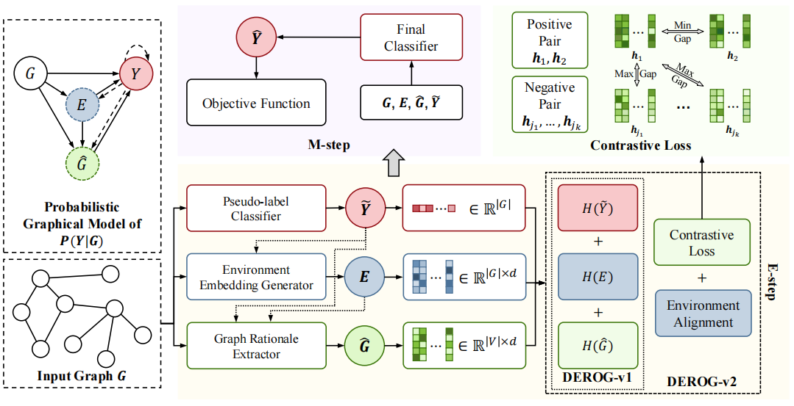

# Improving Graph Out-of-distribution Generalization Beyond Causality

This repository is the official implementation of our paper： **Improving Graph Out-of-distribution Generalization Beyond Causality**.



## Environment

To run the code successfully, the following packages need to be installed:

```
Python                     3.9      
torch                      1.10.1
torch_geometric            2.0.4
```


## Data

This paper uses open benchmark [GOOD](https://github.com/divelab/GOOD) and [DrugOOD](https://github.com/tencent-ailab/DrugOOD). The processed files of each dataset can be downloaded from ```self.url``` in corresponding  ```datasets/dataset_name.py```.

## Scripts

Run ```run.py``` for training and evaluation of DEROG. Here are some example scripts:

```
python run.py --moddel derog --data hiv --gpu 0 --domain scaffold/size --shift covariate/concept
python run.py --moddel derog --data twitter/sst2 --gpu 0 --domain length --shift covariate/concept
python run.py --moddel derog --data motif --gpu 0 --domain basis/size --shift covariate/concept
python run.py --moddel derog --data cmnist --gpu 0 --domain background/color --shift covariate/concept
python run.py --moddel derog --data lbapcore --gpu 0 --domain scaffold/size/assay --shift covariate 
```

## Citation
If you find our paper and this repo useful, please cite our paper:
```bibtex
@article{derog25xu,
      title={Improving Graph Out-of-distribution Generalization Beyond Causality}, 
      author={Can Xu and Yao Cheng and Jianxiang Yu and Haosen Wang and Jingsong Lv and Yao Liu and Xiang Li},
      year={2025},
      eprint={2407.10204},
      archivePrefix={arXiv},
      primaryClass={cs.LG},
      url={https://arxiv.org/abs/2407.10204}, 
}


```